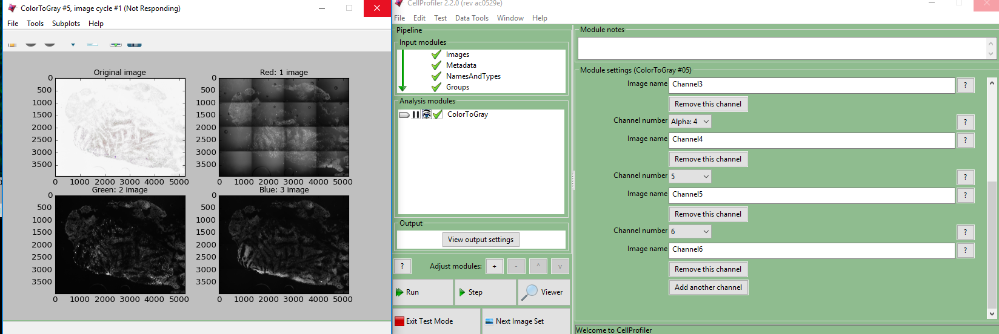

**Summary**

Allow the display for the ColorToGrey module to show an arbitrary number of channels.  

**Background and rationale**

Increasingly CellProfiler is used to study images that have been imaged in >3 channels; for simplicity's sake, these are often stored as a single multichannel file whose colors are split using ColorToGrey's Split->Channels mode.  Split->Channels can work on images with an arbitrary number of channels to split them all out, but in this mode only displays the first 3 channels it has split out, no matter how many channels are included.  [This can cause confusion](http://forum.cellprofiler.org/t/can-you-use-cellprofiler-to-analyze-whole-tissue-samples-6-color-images/4711/5?u=bcimini).

**Proposal**

One of two solutions would be helpful- ideally we could show every channel as it's split out, as CorrectIlluminationApply can for n-channel images.  If for some reason that wasn't possible, simply adding a sentence saying "N more channels not shown".  

**Implementation**

[ColorToGray's code explictly creates each subpanel](https://github.com/CellProfiler/CellProfiler/blob/master/cellprofiler/modules/colortogray.py#L367-L391)

[CorrectIlluminationApply creates a row of 3 each time no matter now many](https://github.com/CellProfiler/CellProfiler/blob/master/cellprofiler/modules/correctilluminationapply.py#L224-L256)

We could compromise by adding a if between 4-8 go 3 wide, 9-15 4 wide, 16-24 5 wide, then add a (N not shown) at the end.
